# withy examples

Generated from `tests/fixtures/*.json`.

## cross_join

- Fixture: `tests/fixtures/cross_join.json`

SQL used to generate the payload:

```sql
SELECT * FROM (SELECT 1 AS a) t1 CROSS JOIN (SELECT 2 AS b) t2
```

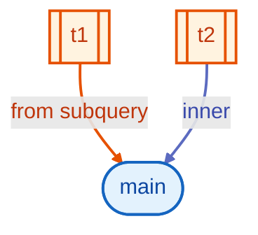

## cte

- Fixture: `tests/fixtures/cte.json`

SQL used to generate the payload:

```sql
WITH cte1 AS (SELECT 1) SELECT * FROM cte1
```

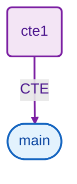

## except

- Fixture: `tests/fixtures/except.json`

SQL used to generate the payload:

```sql
SELECT n FROM (SELECT 1 AS n) EXCEPT SELECT n FROM (SELECT 2 AS n)
```


## having_subquery

- Fixture: `tests/fixtures/having_subquery.json`

SQL used to generate the payload:

```sql
SELECT customer_id, COUNT(*) AS cnt FROM orders GROUP BY customer_id HAVING COUNT(*) > (SELECT AVG(cnt) FROM (SELECT COUNT(*) AS cnt FROM orders GROUP BY customer_id) t)
```

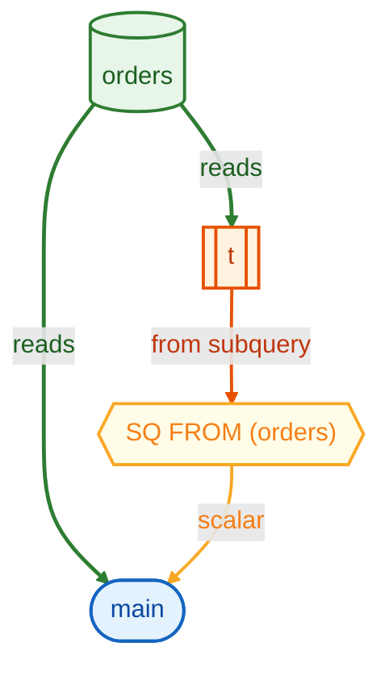

## inner_join_on

- Fixture: `tests/fixtures/inner_join_on.json`

SQL used to generate the payload:

```sql
SELECT a.x, b.y FROM (SELECT 1 AS x) a INNER JOIN (SELECT 1 AS y) b ON a.x = b.y
```

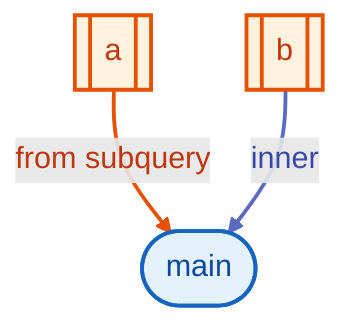

## intersect

- Fixture: `tests/fixtures/intersect.json`

SQL used to generate the payload:

```sql
SELECT x FROM (SELECT 1 AS x) INTERSECT SELECT x FROM (SELECT 1 AS x)
```

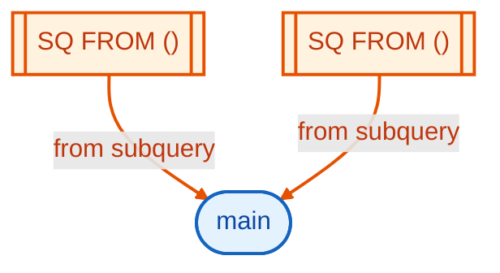

## multiple_ctes

- Fixture: `tests/fixtures/multiple_ctes.json`

SQL used to generate the payload:

```sql
WITH a AS (SELECT 1 AS id), b AS (SELECT id FROM a) SELECT * FROM b
```

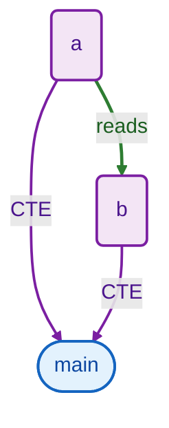

## nested_subqueries

- Fixture: `tests/fixtures/nested_subqueries.json`

SQL used to generate the payload:

```sql
SELECT library_id, location, book_id FROM (SELECT library_id, location FROM (SELECT library_id, location, city FROM libraries)) JOIN (SELECT library_id, book_id FROM books) b ON l.library_id = b.library_id
```

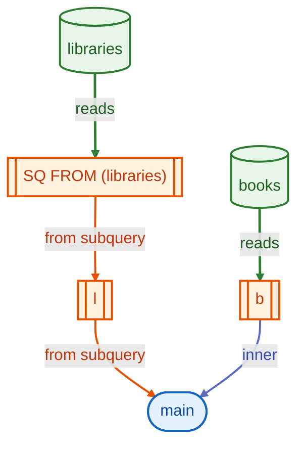

## qualify

- Fixture: `tests/fixtures/qualify.json`

SQL used to generate the payload:

```sql
SELECT id, val, ROW_NUMBER() OVER (ORDER BY val) AS rn FROM (SELECT 1 AS id, 10 AS val UNION ALL SELECT 2, 20) t QUALIFY rn <= 1
```

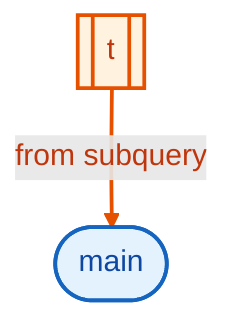

## scalar_cte

- Fixture: `tests/fixtures/scalar_cte.json`

SQL used to generate the payload:

```sql
SELECT artist_id, (SELECT track_name AS t FROM old_tracks) AS scalar_track_name, (WITH esq AS (SELECT * FROM def) SELECT id FROM esq), COUNT(order_id) AS total_orders FROM artists LEFT JOIN tracks USING (artist_id) LEFT JOIN (SELECT order_id FROM orders) USING (track_id) WHERE track_id NOT IN (SELECT track_id FROM old_track_2) GROUP BY 1,2,3
```

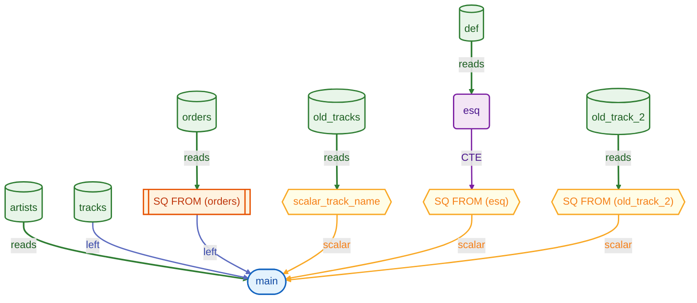

## scalar_order_by

- Fixture: `tests/fixtures/scalar_order_by.json`

SQL used to generate the payload:

```sql
SELECT id, name FROM users ORDER BY (SELECT score FROM config LIMIT 1)
```

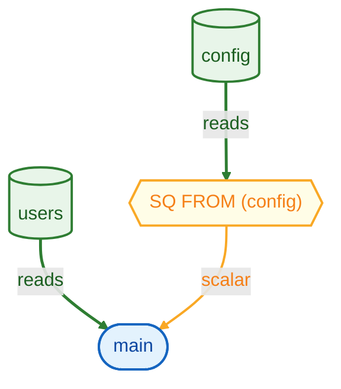

## subquery

- Fixture: `tests/fixtures/subquery.json`

SQL used to generate the payload:

```sql
SELECT * FROM (SELECT 1 AS x) AS sub
```

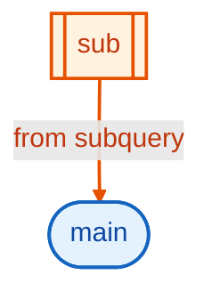

## table_function_only

- Fixture: `tests/fixtures/table_function_only.json`

SQL used to generate the payload:

```sql
SELECT * FROM generate_series(1, 5) AS gs(i)
```

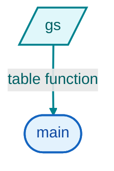

## union

- Fixture: `tests/fixtures/union.json`

SQL used to generate the payload:

```sql
WITH seeds AS (SELECT val FROM generate_series(1,4789) gs(val) UNION SELECT val FROM generate_series(5001,8401) gs(val)), voyages AS (SELECT number FROM 'voyages.csv'), voyages_missing AS (SELECT 'voyages' AS table, seeds.val AS missing_id FROM seeds LEFT JOIN voyages ON seeds.val = voyages.number::INT WHERE voyages.number IS NULL) SELECT * FROM voyages_missing
```

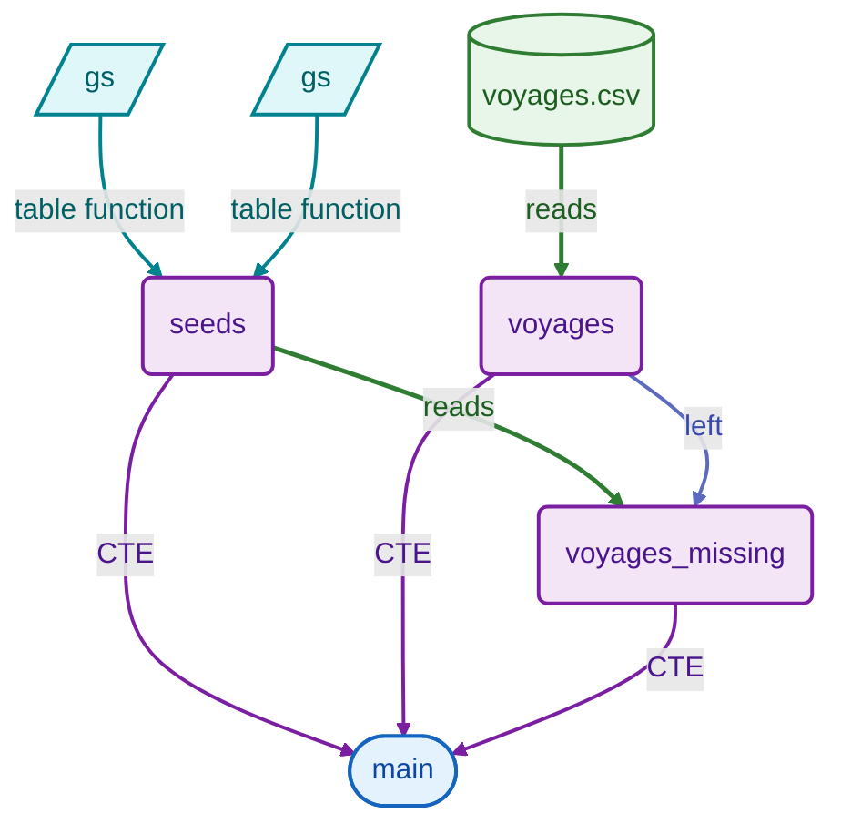

## where_exists

- Fixture: `tests/fixtures/where_exists.json`

SQL used to generate the payload:

```sql
SELECT * FROM orders o WHERE EXISTS (SELECT 1 FROM products p WHERE p.id = o.product_id)
```

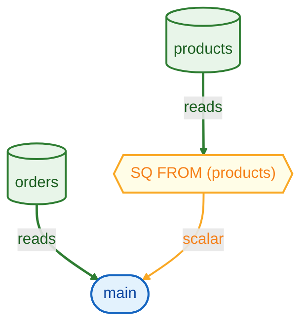
