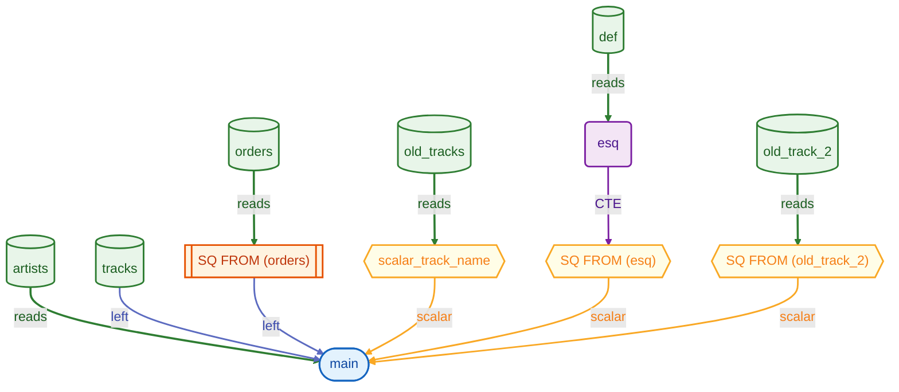

# withy

Parse DuckDB's `json_serialize_sql` output to visualize query lineage (CTEs, subqueries).

## Setup

```bash
nvm use   # or ensure Node >= 20
npm install
npm run build
```

## Usage

**Library**

```ts
import { parseSerializedSQL, extractLineage } from "withy";

const result = parseSerializedSQL(jsonFromDuckDB);
if (result.ok) {
  const lineages = extractLineage(result.data);
  // lineages[].nodes, lineages[].edges
  // Edges for JOIN right-hand side include join_type, ref_type, columns (USING or ON columns)
}
```

**CLI** (after `npm run build`)

```bash
# From file
node dist/cli.js path/to/duckdb-output.json

# From stdin
echo '{"error":false,"statements":[...]}' | node dist/cli.js
```

CLI output is a JSON array of `{ nodes, edges }` per statement. Edges that are the right side of a JOIN include `join_type`, `ref_type`, and `columns` when present.

### Mermaid output

**Library** – get a Mermaid flowchart string from lineage:

```ts
import { parseSerializedSQL, extractLineage, lineageToMermaid } from "withy";

const result = parseSerializedSQL(jsonFromDuckDB);
if (result.ok) {
  const lineages = extractLineage(result.data);
  const mermaid = lineageToMermaid(lineages[0]);
  console.log(mermaid);
  // Multiple statements: lineages.map(lineageToMermaid).join("\n\n---\n\n")
}
```

**CLI** – use `-f mermaid` (or `--format mermaid`) to print Mermaid instead of JSON:

```bash
# From file
node dist/cli.js -f mermaid path/to/duckdb-output.json

# From stdin
echo '{"error":false,"statements":[...]}' | node dist/cli.js --format mermaid
```

With `npx withy` (after `npm link` or install): `npx withy -f mermaid path/to/file.json`.


## Getting input from DuckDB

In DuckDB:

```sql
SELECT json_serialize_sql('SELECT * FROM (SELECT 1 AS x) AS sub');
SELECT json_serialize_sql('WITH cte1 AS (SELECT 1) SELECT * FROM cte1');
```

Use the returned JSON string as input to withy.


### Example

Raw query (DuckDB `json_serialize_sql` input):

```sql
SELECT
    artist_id,
    (SELECT track_name AS t FROM old_tracks) AS scalar_track_name,
    (WITH esq AS (SELECT * FROM def) SELECT id FROM esq),
    COUNT(order_id) AS total_orders
FROM artists
LEFT JOIN tracks USING (artist_id)
LEFT JOIN (SELECT order_id FROM orders)
  USING (track_id)
WHERE track_id
  NOT IN (SELECT track_id FROM old_track_2)
GROUP BY 1,2,3;
```

Run: `node dist/cli.js path/to/duckdb-output.json -f mermaid`

Mermaid output:



## Scripts

- `npm run build` – compile TypeScript to `dist/`
- `npm run test` – run tests
- `npm run typecheck` – type-check without emitting
